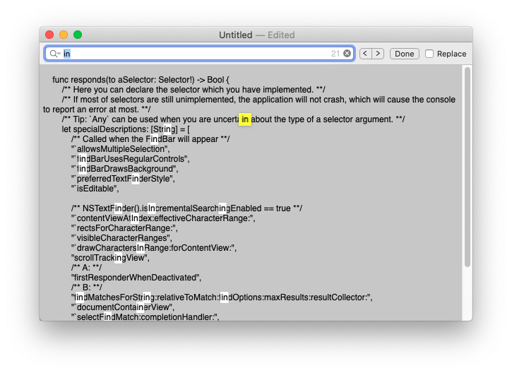

> Sample Code

## Introduction

Learning the usage of NSTextFinder, for implementing the elegant find function for your Application.

## NSTextFinderClient

There are two very interesting properties as below:

```swift
            textFinder.incrementalSearchingShouldDimContentView = true
            textFinder.isIncrementalSearchingEnabled = true
```

In order to facilitate debugging and clarify the running process, the code adds a lot of console printing. Please forgive me. 😅 

## Demo

The rest of the code refers [Developing a Document-Based App](https://developer.apple.com/documentation/appkit/documents_data_and_pasteboard/developing_a_document-based_app).


